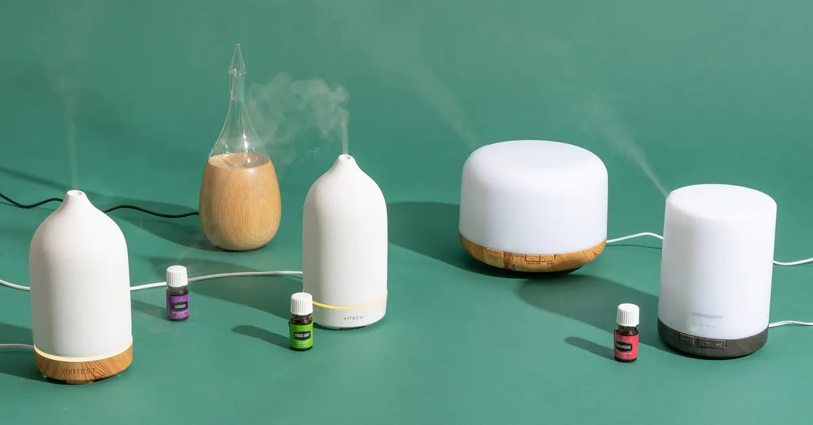
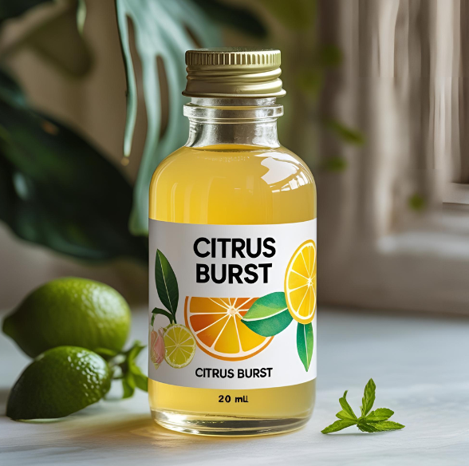

# 🌿 Magicana – Smart Aromatic Diffuser

**Mistique** is a beautifully designed landing page for a smart aromatic diffuser brand. Built with modern HTML and CSS, the layout highlights features, fragrance collections, and contact details in a clean, aesthetic way.

## 🚀 Project Highlights

- Hero Section** with brand tagline and brief intro
- Sticky Navigation Bar** linking to main sections
- Features Grid** showcasing product highlights
- Fragrance Gallery** with custom visuals for:
  - Lavender Calm
  - Citrus Burst
  - Mint Refresh
  - Rose Garden
- About Us Section** with detailed brand message
- Contact Section** with social/email
- Footer** with copyright info

## 🧩 Tech Stack

- HTML5
- CSS3 (including Flexbox, Grid, Media Queries)
- Image assets (custom .webp and .png)

## 🖼 Preview

Main background:  


Fragrance visuals:  
- 
- 
- 
- 

## 📁 Project Structure

```

├── index.html             # Main landing page
├── styles.css             # All styles and media queries
├── essential-oil-diffuser-2048px-4244-2x1-1.webp  # Hero section background
├── pastel2.avif           # Background for fragrance section
├── mint.png               # Mint fragrance image
├── lavedit.png            # Lavender fragrance image
├── rose.png               # Rose fragrance image
├── citrus.png             # Citrus fragrance image

```

## 📝 Setup Instructions

Just open `index.html` in your browser. No dependencies or frameworks required.

## 📌 Future Improvements

- Add fragrance descriptions on hover
- Integrate form submission in Contact section
- Add ordering functionality

---

💡 _Relax, Refresh, Recharge with Mistique._
```
